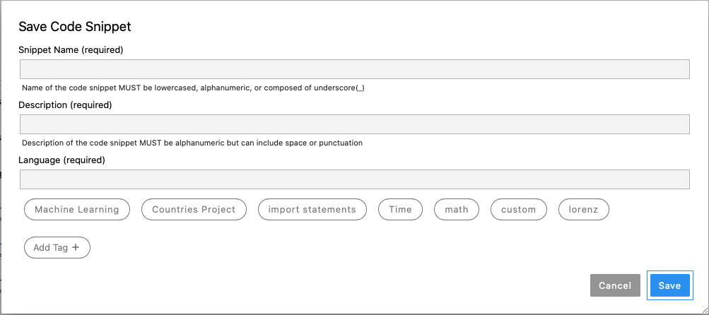
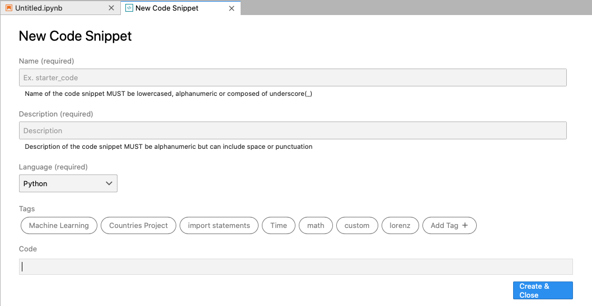
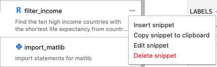
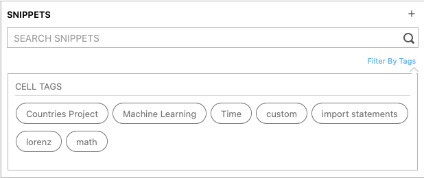
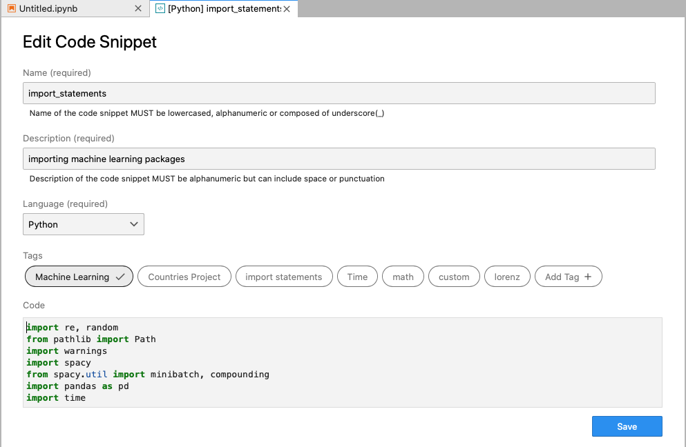

Features
========

Creation of a New Snippet
-------------------------

-  Right click and save highlighted code (lines of code)
-  Drag cell into panel to save (lines of code)

-  Plus button to create a new snippet from scratch

Use of Code Snippets
--------------------

-  Copy, Insert, Delete snippet
-  Drag snippet into any JupyterLab workspace

Search of Code Snippets
-----------------------

-  Scrollable/resizable snippet explorer panel displaying snippets
-  Move snippet within snippet explorer
-  Search bar for snippets
-  Filter tags for snippets
-  Snippet preview (on the side)

Edit of Existing Code Snippets
------------------------------

-  Code Snippet Editor
