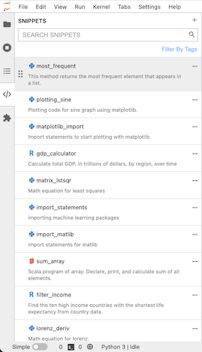
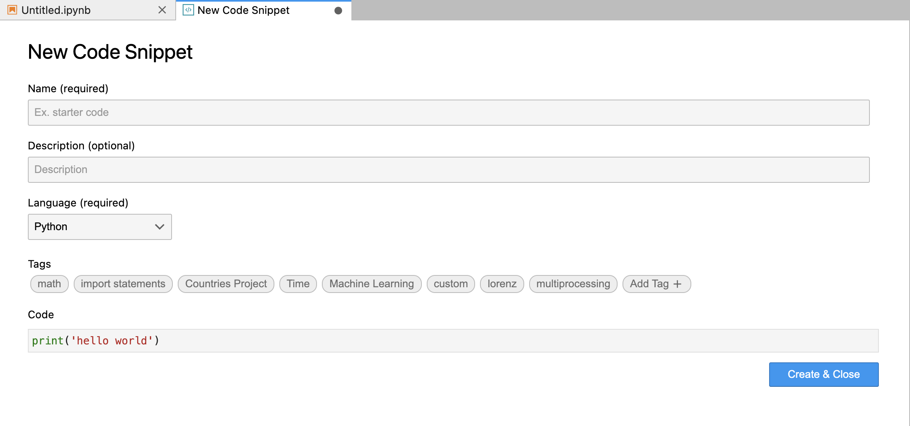
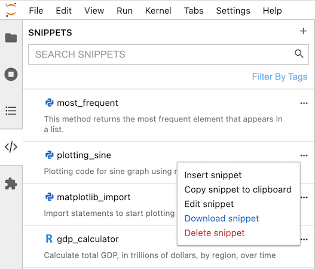
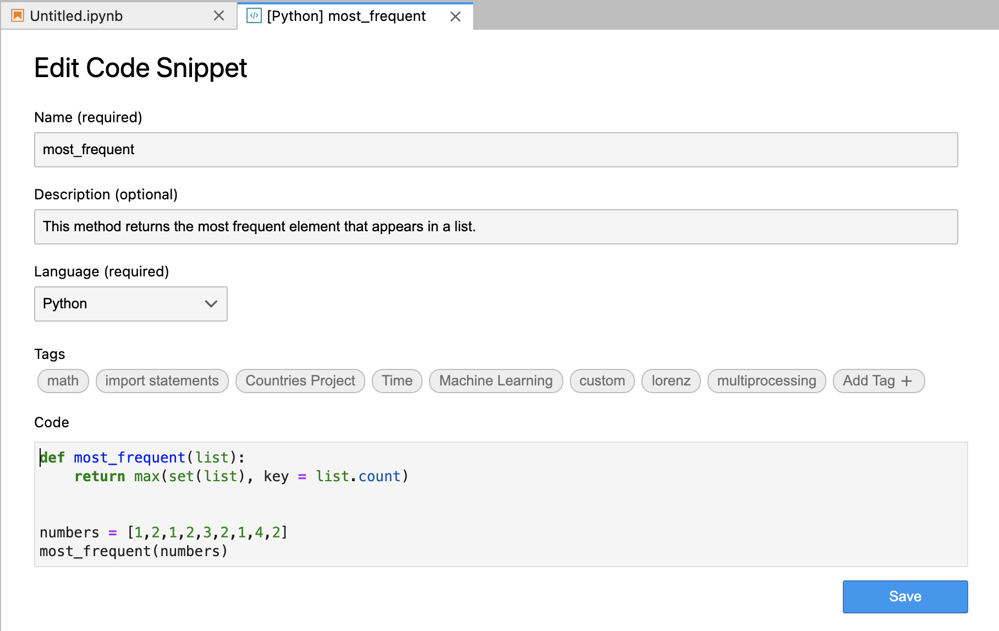
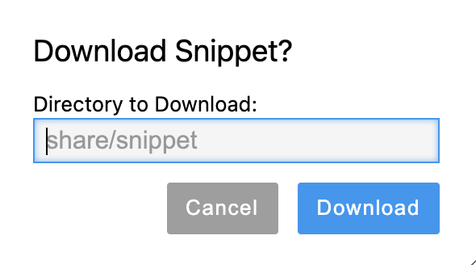
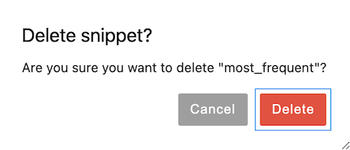
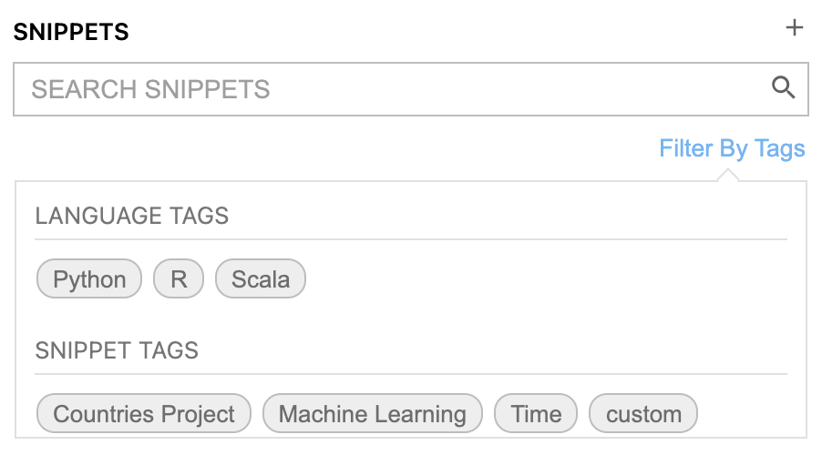
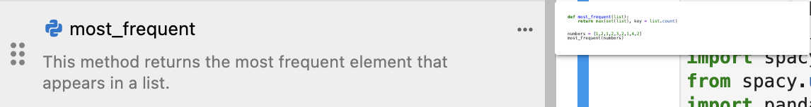

Features
========

Code Snippet Explorer
---------------------

On the left side bar of the JupyterLab, you can click the snippet icon (</>) to open/close the code snippet explorer that contains all the saved snippets as below.
You can scroll/resize code snippet explorer, order the snippets with drag and drop, and manage and search the snippets.

Creation of a New Snippet
-------------------------

There are several ways to create a new snippet.

1. Highlight lines of code and right click (or use keyboard shortcut (cmd-shift-A or ctrl-shift-A)) to save the code as a snippet. Or, you can select cell(s) and right click (or use keyboard shortcut (cmd-shift-A or ctrl-shift-A)) to save content as a snippet. Then, you will see the "Save As Code Snippet" option in JupyterLab context menu as below:

    .. image:: ../../Design/right_click.png
        :align: center

    Clicking the option will open the dialog as below where you can input name, description, language, and tags of the snippet.

    .. image:: ../../Design/code_snippet_input_dialog.png
        :align: center

2. More easily, just drag notebook cell(s) to the code snippet explorer on the left to create a new snippet. It will also open the dialog as above for your inputs.

3. Hit the plus button next to the search bar (refer to `Search of Code Snippets`_) to create a new snippet from scratch.

Use of Code Snippets
--------------------

Click the three dots or right click anywhere on the snippet you want to use. It will open code snippet menu as below to insert, copy, edit, download, or delete the snippet.

Insert
^^^^^^
Click the insert option to insert. It will warn you if the language is different from the kernel langauge. 
Additionally, on hover with six dots on the left (refer to `Search of Code Snippets`_), drag snippet into any JupyterLab workspace to insert the snippet!

Copy
^^^^
Click the copy option to copy. It will create a message on the bottom right corner as below.

Edit
^^^^
Edit the saved snippets by clicking the edit option. It will open a code snippet editor as below.

Download
^^^^^^^^
Download snippets and share them with others by clicking the download option. It will open a box as below to input **relative path** to download the snippets.

Delete
^^^^^^
Delete snippets by clicking delete option. It will open a warning box as below.

Search of Code Snippets
-----------------------

With the filter box as below, **search** snippets with name, language, and code with search bar or **filter** them with language/filter tags!  

Furthermore, hover over snippets to see the preview of each snippet.

Change Font Size of Snippet Preivew
-----------------------------------
In the JupyterLab Settings -> Advanced Settings Editor, users can set the size of code in snippet preview to see part of its content clearly.

.. image:: ../../Design/changePreivewFontSize.gif
    :align: center
