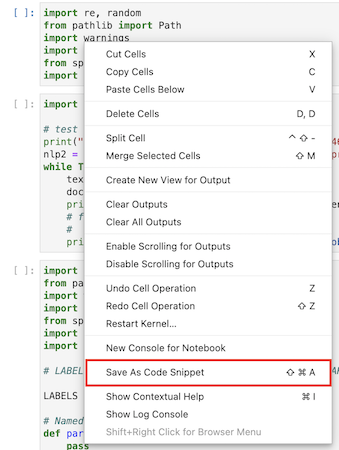
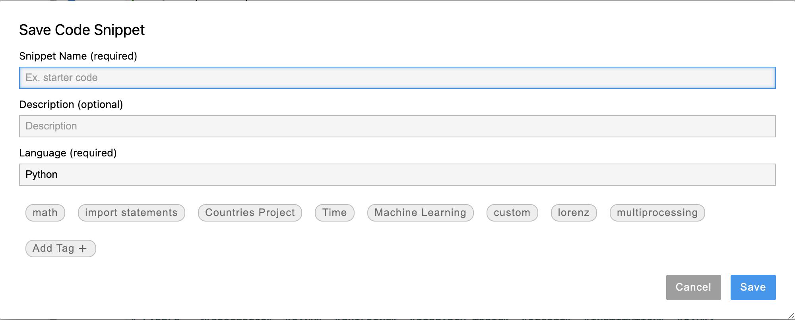
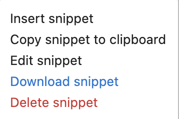

Features
========

Creation of a New Snippet
-------------------------

-  Right click (or use keyboard shortcut (cmd-shift-A or ctrl-shift-A)) and save highlighted lines of code
-  Drag cell into panel to save
-  Select cell(s) and right click to save content as snippet
-  Select cell(s) and use keyboard shortcut (cmd-shift-A or ctrl-shift-A) to save content as snippet

.. image:: ../../Design/create_from_scratch.png
-  Plus button to create a new snippet from scratch

Use of Code Snippets
--------------------

-  Copy, Insert, Edit, Download, Delete snippet
-  Drag snippet into any JupyterLab workspace

Search of Code Snippets
-----------------------

.. image:: ../../Design/code_snippet_filter_box.png
-  Scrollable/resizable snippet explorer panel displaying snippets
-  Move snippet within snippet explorer
-  Search bar for snippets
-  Filter tags for snippets

.. image:: ../../Design/code_snippet_preview.png
-  Snippet preview (on the side)

Edit of Existing Code Snippets
------------------------------

.. image:: ../../Design/code_snippet_edit.png
-  Code Snippet Editor
