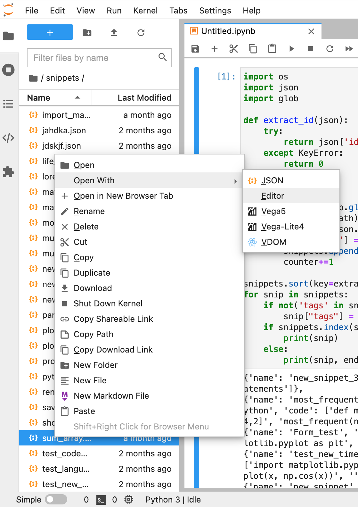
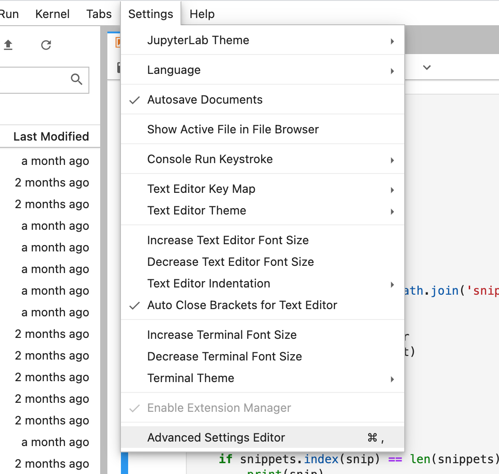
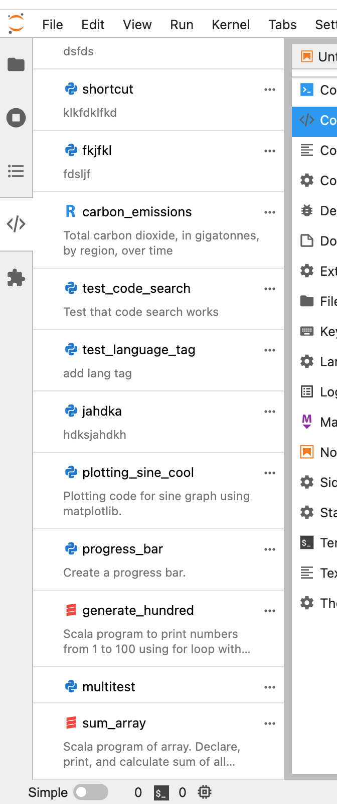
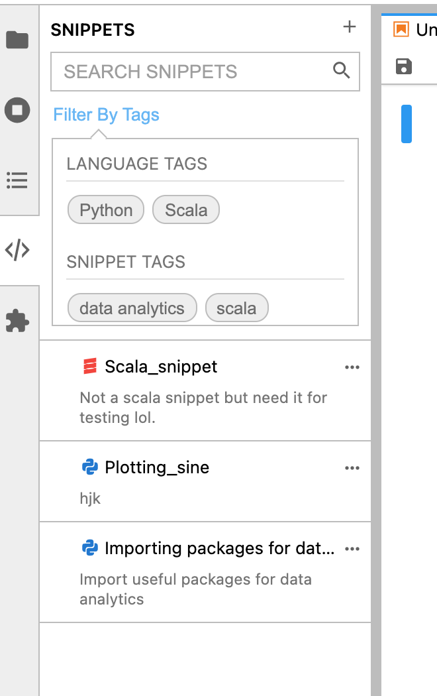
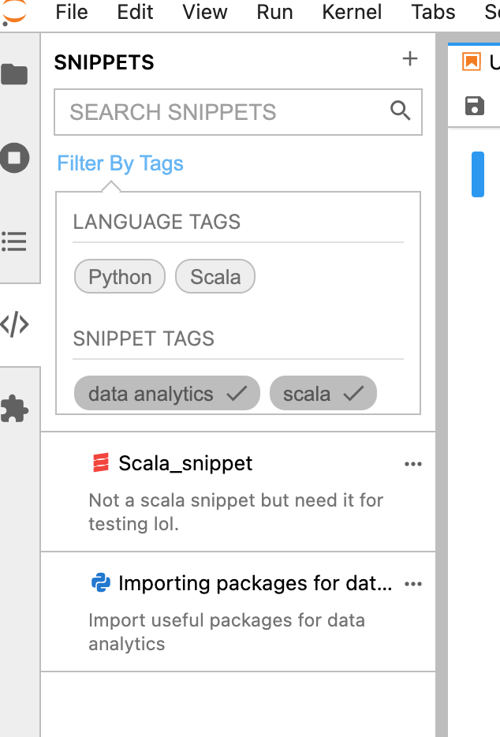
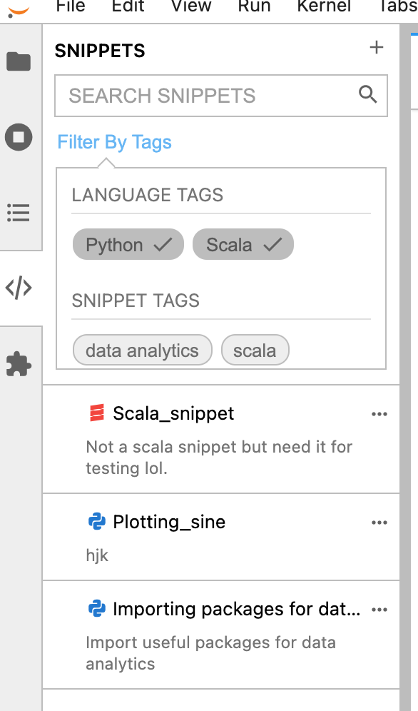
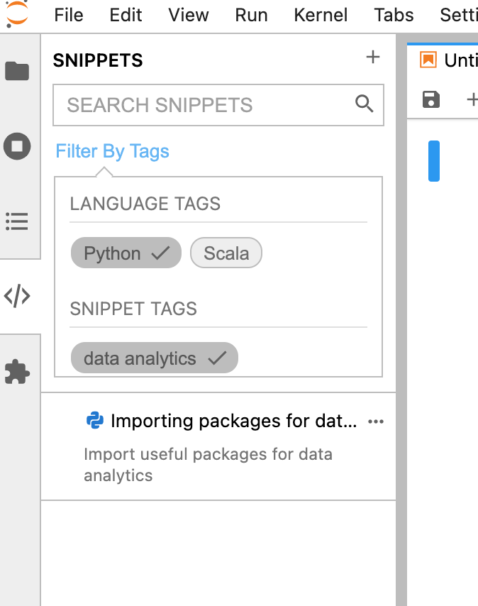
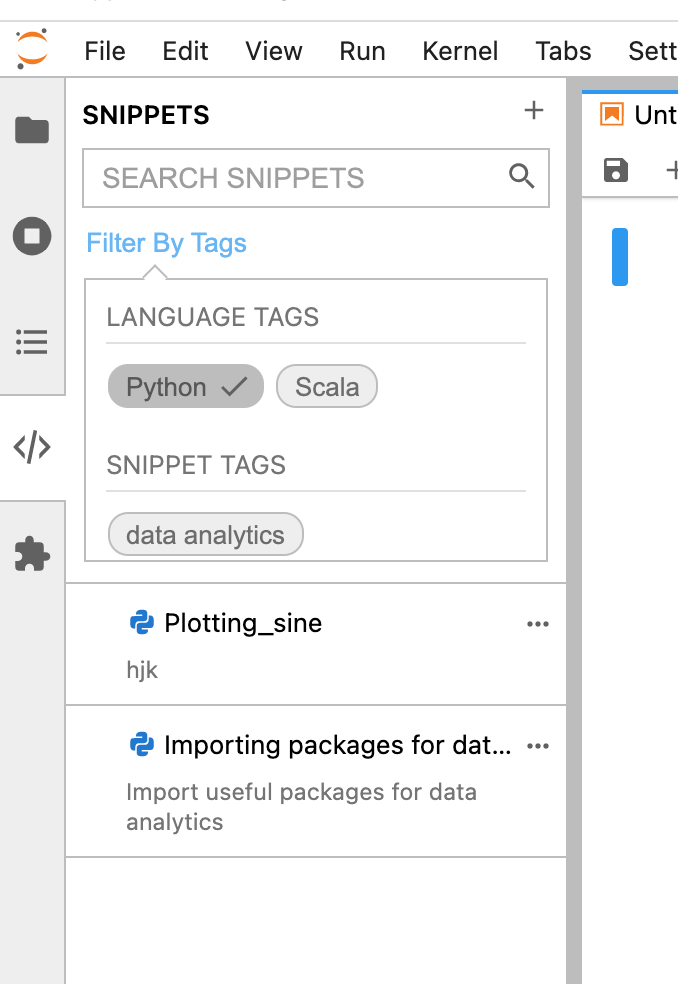

Transition to 2.1.0
===================

The 2.1.0 update has made snippets globally accessible across notebooks by saving 
them at the JupyterLab Settings API endpoint.

One side effect of this change is that snippets created in the previous version of 
this extension will not be supported. The /snippets folder will continue to be available
if previously created in a project folder.

In addition, the searching/tag feature has been expanded as well.

Transferring Single Snippets
----------------------------

To add old snippets to the new snippet location, simply copy the JSON object and go to:
Settings > Advanced Settings Editor > Code Snippet Manager

In the User Preferences panel there will be an array of snippets existing globally
(something like "snippets" : [...]) where the ... are the globally accessible
snippets.

At the end of the existing list, paste the copied JSON object, make sure the id value is
sequential to what already is in the list. Save using the save icon in the top right corner.
Snippet should appear in the snippets panel!

Open JSON file of snippet to upload:

Copy the JSON object:

.. image:: ../../Design/copy_JSON.png
   :align: center

Navigate to settings:

Paste JSON object into list of snippets:

.. image:: ../../Design/saveASingleSnippet.gif
   :align: center

After saving, new snippet should appear at the bottom of the snippets list in the snippet panel:

Transferring Multiple Snippets
------------------------------

To help with converting entire /snippets folder worth of snippets we have developed a python
script to help with the transition:

.. code::

    import os
    import json
    import glob

    def extract_id(json):
        try:
            return json['id']
        except KeyError:
            return 0

    snippets = []
    counter = 0
    for filepath in glob.glob(os.path.join('snippets', '*.json')):
        with open(filepath) as f:
            content = json.load(f)
            content['id'] = counter
            snippets.append(content)
            counter+=1

    snippets.sort(key=extract_id)
    print('{"snippets": [\n')
    for snip in snippets:
        if not('tags' in snip):
            snip["tags"] = []
        if snippets.index(snip) == len(snippets)-1:
            print(json.dumps(snip, indent=4, sort_keys=True))
        else:
            print(json.dumps(snip, indent=4, sort_keys=True), end=",\n")
    print("]\n}\n")

This script will concatenate and print out all of the json objects in a /snippets folder
in a project. After running the script, copy the output and paste into the User Preferences
panel in settings, similar to the single snippet upload.

Search and Tag Update
---------------------

NOTE: Snippet tags function on an OR basis, as in when the "data analytics" tag and the "import statements" tag are selected together, 
the panel displays any tags that are tagged as import statements OR tagged as "data analytics."
ex) Snippet tags selected together:

ex) Language tags selected together:

NOTE 2: Language tags and snippets tags have an AND relationship. As in when the "Python" tag and the "data analytics" tags are selected together, 
only snippets that are both in the language Python AND tagged as data analytics will appear.

NOTE 3: When language tags are selected, only snippet tags in that language will appear for ease of selection.

